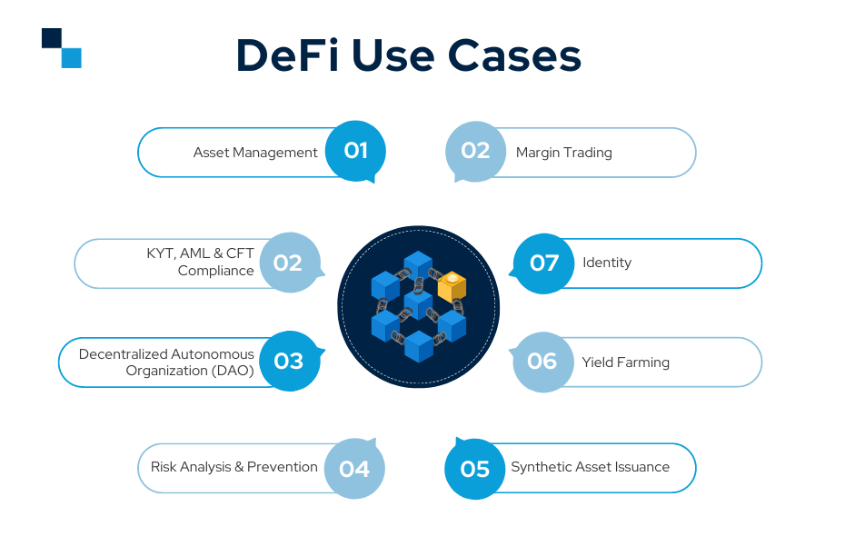

# Task: Research and Analyze a DeFi Protocol

## What is DeFi?

## Introduction

DeFi, short for Decentralized Finance, is a revolutionary concept that aims to transform traditional financial systems by leveraging blockchain technology. Unlike traditional finance, DeFi eliminates the need for intermediaries, such as banks or financial institutions, by building a decentralized ecosystem of financial applications on public blockchains like Ethereum.

## Key Features

- **Decentralization**: DeFi applications are powered by blockchain networks, ensuring no central authority controls the ecosystem. Transactions and operations are verified and recorded by a distributed network of nodes.

- **Openness**: DeFi protocols and smart contracts are open-source, allowing transparency, community inspection, and collaborative development. Anyone can review the code, contribute, and suggest improvements.

- **Interoperability**: DeFi encourages interoperability, enabling various applications to interact and share data seamlessly across different platforms. This creates a connected and efficient financial ecosystem.

- **Programmability**: Smart contracts enable programmable financial agreements and transactions. Users can automate complex financial operations and create new financial instruments, fostering innovation.

- **Accessibility**: DeFi services are accessible to anyone with an internet connection, without the need for a traditional bank account or credit check. This promotes financial inclusion and global accessibility.

## DEFI Protocols

DeFi protocols consist of standards, codes, and procedures that govern decentralized financial applications.

## How do DeFi protocols works?

Defi protocols consists of **standards, codes, and procedures** that govern decentralized financial applications. These protocols enable trading, lending, yield farming, and more. For a DeFi protocol to work correctly, it must abide by a specific set of rules that all wallets must follow when engaging with it.

Most DeFi protocols are **autonomous programs** that aim to improve upon the processes used in traditional finance. For example, DeFi aggregators like Zapper integrate with decentralized exchanges to consolidate trading and liquidity pools in a single place. These aggregators help to eliminate the struggles associated with finding the best yields and lowest prices.

## Primary Use Cases

### Top 8 Use cases of Defi

With Defi gaining global traction across the globe, there are countless use cases that every DeFi enthusiast and emerging market leader must be aware of.

1. **Asset Management** :-
   One of the notable use cases of DeFi is that individuals get the authority to experience more control over their assets than ever before. Since the users now have the power of managing their virtual assets, they can even earn from those assets. Unlike the traditional system where the users had to share their account credentials with third parties, DeFi development safeguards the confidential data of customers with no need of sharing it with any third party as the concept of DeFi simply removes the involvement of intermediaries.

2. **KYT, AML & CFT Compliance** :-
   Traditional financial institutions are majorly based on Know Your Customer (KYC) standards which further help in implementing AML and CFT measures. However, KYC rules impede the confidentiality initiatives of DeFi. This is where Know Your Transaction (KYT) combats the challenge and focuses on payment patterns rather than identifying users. The prime issues solved by KYT include safeguarding customers’ anonymity and analyzing actual transaction activity. Therefore, this is one of the notable decentralized finance use cases that grabs the attention of emerging crypto enthusiasts.

3. **Decentralized Autonomous Organization (DAO)** :-
   Similar to controlled banking institutions that tackle core financial operations like establishing governance, generating funds, and maintaining resources, blockchain-powered ecosystems ensure decentralized systems carry out the same but in a completely decentralized manner. DAOs are completely independent and don’t have the control and involvement of any central agency. DAOs act as the pillar of DeFi development services.

4. **Risk Analysis & Prevention** :-
   Due to decentralization and transparency, individuals can now identify and analyze silos of data which further helps in making better and more accurate decisions, discovering innovative economic opportunities, and practicing improved threat management strategies. Stepping forward, there are numerous analytics and risk management tools such as CoDeFi and DeFi Pulse which hold a lot of potential in this area. This is one of the prominent DeFi use cases.

5. **Synthetic Asset Issuance** :-
   Synthetic asset issuance is one of the complicated applications of DeFi which involves a process to build a digital asset token representing the properties of anything- from commodities, digital assets, metals, and derivatives, to stocks. Synthetic assets can be purchased, sold, or even traded while enabling the users in gaining knowledge of other assets.

6. **Yield Farming** :-
   The term yield farming has gained wide popularity in the DeFi blockchain development space. Under yield farming, users lock up digital assets and get rewards in return which are automatically provided by smart contracts. The majority of the time, yield farming projects need the user to stake liquidity provider (LP) tokens received after providing liquidity at some particular decentralized exchanges.
7. **Identity** :-
   Another area where DeFi development companies are reaping the benefits from DeFi is identity. DeFi protocols backed with blockchain-powered identity systems hold the ability to assist locked-out users in gaining access to a completely global economic system further minimizing the collateralization needs for individuals who lack sufficient funds. Besides this, DeFi also helps in improving users’ creditworthiness through parameters like reputation and financial activity rather than traditional data points like overall income, home ownership, etc.
8. **Margin Trading** :-
   In the case of traditional finances, margin traders utilize their trades while they borrow funds from a broker further creating collateral for a loan. However, when it comes to DeFi blockchain development, it is backed by non-custodial and decentralized lending protocols, and the power of smart contracts has automated traditional brokerage activities and become one of the potential DeFi use cases.

# UNISWAP v2
