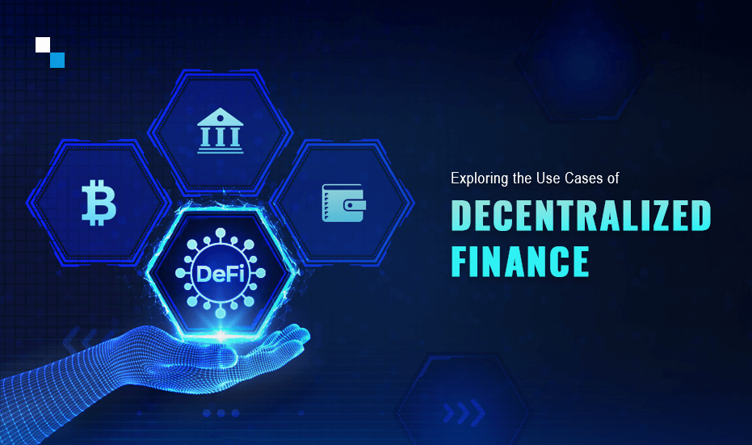

# Task: Research and Analyze a DeFi Protocol

## What is DeFi?

## Introduction

DeFi, short for Decentralized Finance, is a revolutionary concept that aims to transform traditional financial systems by leveraging blockchain technology. Unlike traditional finance, DeFi eliminates the need for intermediaries, such as banks or financial institutions, by building a decentralized ecosystem of financial applications on public blockchains like Ethereum.

## Key Features

- **Decentralization**: DeFi applications are powered by blockchain networks, ensuring no central authority controls the ecosystem. Transactions and operations are verified and recorded by a distributed network of nodes.

- **Openness**: DeFi protocols and smart contracts are open-source, allowing transparency, community inspection, and collaborative development. Anyone can review the code, contribute, and suggest improvements.

- **Interoperability**: DeFi encourages interoperability, enabling various applications to interact and share data seamlessly across different platforms. This creates a connected and efficient financial ecosystem.

- **Programmability**: Smart contracts enable programmable financial agreements and transactions. Users can automate complex financial operations and create new financial instruments, fostering innovation.

- **Accessibility**: DeFi services are accessible to anyone with an internet connection, without the need for a traditional bank account or credit check. This promotes financial inclusion and global accessibility.

## DEFI Protocols

DeFi protocols consist of standards, codes, and procedures that govern decentralized financial applications.

## How do DeFi protocols works?

Defi protocols consists of **standards, codes, and procedures** that govern decentralized financial applications. These protocols enable trading, lending, yield farming, and more. For a DeFi protocol to work correctly, it must abide by a specific set of rules that all wallets must follow when engaging with it.

Most DeFi protocols are **autonomous programs** that aim to improve upon the processes used in traditional finance. For example, DeFi aggregators like Zapper integrate with decentralized exchanges to consolidate trading and liquidity pools in a single place. These aggregators help to eliminate the struggles associated with finding the best yields and lowest prices.

## Primary Use Cases
